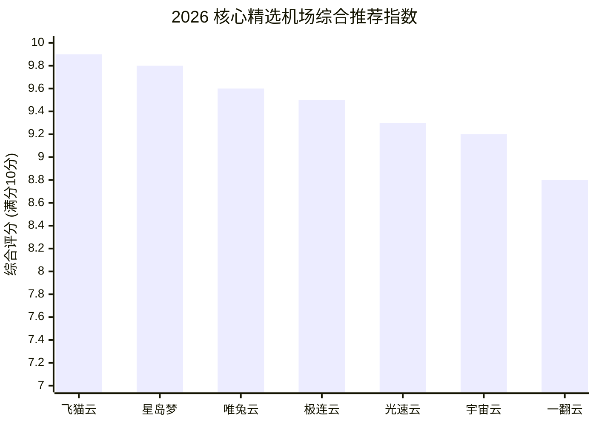
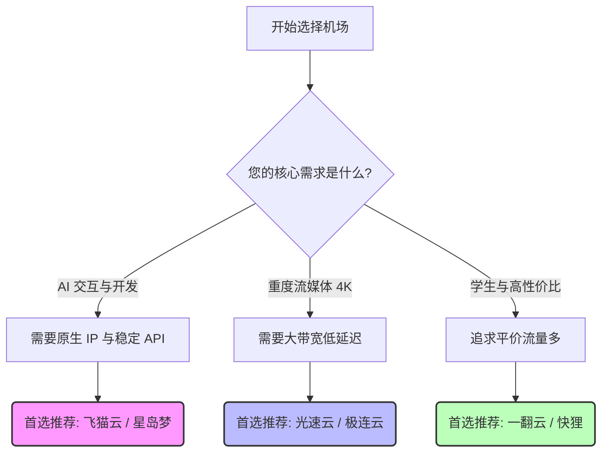

# 2026 最新稳定翻墙机场推荐与专线网络测速榜 ✈️ | 银翼机场测评

> **📌 本项目定位：** 2026 严选极速秒开节点指南，提供最新、最便宜好用的VPN机场评测、IEPL专线推荐及Clash/Shadowrocket科学上网教程。
> 保持 100% 独立客观评测 · 拒绝倍率陷阱与虚假带宽。
>
> 💡 **更全的图文评测、实时测速数据与优惠活动请访问我的独立博客：** [银翼机场测评 (clash-vless.com)](https://clash-vless.com/)

**关键词：** 机场推荐、2026机场推荐、翻墙机场、科学上网、便宜机场、稳定梯子、国内好用机场推荐、美国机场推荐、VPN评测、IEPL专线

---

## 📢 致读者 / 开场白 (Introduction)

大家好，我是**银翼测评**的维护者。建立这个 GitHub 仓库，是为了在如今鱼龙混杂的“科学上网”与“机场”市场中，为大家整理一份**真正靠谱、实测稳定**的精选清单。

在过去的一年里，我们的团队自费购买并测试了超过百余家机场，经历了晚高峰限速、专线频繁断流、节点失联甚至是小机场直接“跑路”等各种坑。我们深知，对于程序员、科研人员、跨境电商以及重度流媒体爱好者来说，一条**随时秒开、低延迟、不丢包**的专线网络有多么重要。

在这个仓库中，我们剔除了大量劣质选项，最终只保留了经过严苛的 24/7 晚高峰压测、具备高冗余 BGP/IEPL 链路且**极具性价比**的 16 家精选机场。之所以将推荐数量控制在这个范围，是因为只有这样，我们团队才能保持每个月甚至每周的深度复测与跟进。

这里**拒绝虚假带宽标称，拒绝隐藏的倍率陷阱**。我们坚持 **100% 独立客观的评测**，希望能帮大家省下金钱与试错的宝贵时间。

## ℹ️ 关于本项目 (About)

- **项目主旨：** 长期追踪并推荐 2026 年度最新、最稳定、平价极速的翻墙机场及 IEPL/IPLC 物理专线。
- **适用人群：** 
  - 👨‍💻 **开发者与学术科研：** 频繁访问 GitHub / StackOverflow / arXiv 且对 SSH 长连接有高要求的专业人群。
  - 🤖 **AI 深度依赖者：** 需要纯净原生 IP 解锁 ChatGPT 4o / Claude 3.5 / Midjourney 的用户。
  - 🎬 **重度流媒体玩家：** 追求 Netflix / Disney+ / YouTube 4K、8K 顺畅秒开的影音发烧友。
- **同步更新：** 本仓库的数据与排行榜单会根据各大机场的表现进行定期调整。
- **官方博客：** 获取更详尽的单品深度评测文章、晚高峰测速大表以及全平台（Clash/V2RayN/Shadowrocket）配置教程，请访问我们的官方网站：**[银翼机场测评 (clash-vless.com)](https://clash-vless.com/)**。

---

## 💖 支持与订阅 (Star & Watch)

如果您觉得这份榜单帮到了您，**请点击页面右上角的 `⭐ Star` 支持一下！** 您的支持是我们持续自费测速、维护榜单的最大动力。
同时，强烈建议您点击 **`👀 Watch` (选择 Custom -> Releases / All Activity)**，我们会在 GitHub 优先更新：
- 🎁 **限时粉丝福利：** 不定期掉落的大额专属隐藏折扣码。
- ⚡ **测速报告更新：** 每次重大网络波动、晚高峰墙高发期的最新排名变动。

## 📊 核心推荐指数对比 (综合评分)

我们根据过去的长期测速与稳定性追踪，为几个最具代表性的机场打出了综合推荐指数（满分 10 分）。分数越高，代表**晚高峰稳定性越好**、**性价比越高**，您可以更直观地根据评分进行盲选：

## 🎯 极速选购指南（如何选择适合我的？）

如果您不想看繁琐的参数，可以直接参考以下的**选购决策流程图**：

为了帮您节约时间，我们直接总结了三大核心需求场景的“盲选”方案：

| 需求场景 | 推荐选购方向 | 典型代表品牌 |
| :--- | :--- | :--- |
| **🤖 AI 与开发核心 (ChatGPT / API / GitHub)** | 需要**原生纯净 IP** 和 **BGP 智能路由**，确保 API 接口不中断，封号率极低。 | **[飞猫云](#1-飞猫云-flycat---程序员与重度流媒体首选)**、**[星岛梦](#2-星岛梦---高性价比美日港极速专线)** |
| **🎬 重度流媒体发烧友 (Netflix / 4K / 8K)** | 需要**高冗余大带宽**和**极低晚高峰丢包率**，流媒体区域全解锁。 | **[光速云](#4-光速云---大负载均衡处理)**、**[极连云](#6-极连云---高质量高冗余底层)** |
| **🎓 学生与高性价比 (日常查阅 / 网页浏览)** | 需要**平价实惠**，流量充足，能够满足基础的 Google / Wikipedia 查阅即可。 | **[一翻云](#9-一翻云---平价轻量研发加速)**、**[快狸](#16-快狸---敏捷提速经济方案)** |

## 🛠️ 主流客户端下载与配置指南

我们整理了目前市面上最流行、最好用的科学上网客户端。完整的新手图文配置教程，请移步我们的博客阅读：

- 🍏 **Apple iOS (苹果手机/平板)：** Shadowrocket (小火箭) / Quantumult X / Loon / Surge
  - 👉 *[获取美区 Apple ID 与 iOS 配置保姆级教程](https://clash-vless.com/)*
- 🪟 **Windows (电脑端)：** Clash Verge rev / v2rayN / Sing-box
  - 👉 *[Windows 客户端下载与智能分流配置指南](https://clash-vless.com/)*
- 🤖 **Android (安卓手机)：** Clash for Android / v2rayNG / Surfboard
- 🍎 **macOS (苹果电脑)：** Clash Verge rev / Surge for Mac / Shadowrocket

---

## 📋 目录导航

- [⭐ 综合评测首选榜单 (Top Picks)](#-综合评测首选榜单-top-picks)
  - [1. 飞猫云 (Flycat) - 程序员与重度流媒体首选](#1-飞猫云-flycat---程序员与重度流媒体首选)
  - [2. 星岛梦 - 高性价比美日港极速专线](#2-星岛梦---高性价比美日港极速专线)
  - [3. 唯兔云 (V2yun) - 一键连通专家](#3-唯兔云-v2yun---一键连通专家)
  - [4. 光速云 - 大负载均衡处理](#4-光速云---大负载均衡处理)
  - [5. U1S1 - 实诚倍率无虚标架构](#5-u1s1---实诚倍率无虚标架构)
  - [6. 极连云 - 高质量高冗余底层](#6-极连云---高质量高冗余底层)
  - [7. 全球云 - 全球节点全区全覆盖](#7-全球云---全球节点全区全覆盖)
  - [8. 光年梯 - 低抖动优质网络池](#8-光年梯---低抖动优质网络池)
  - [9. 一翻云 - 平价轻量研发加速](#9-一翻云---平价轻量研发加速)
  - [10. 二猫云 - 清爽简易多终端通连](#10-二猫云---清爽简易多终端通连)
  - [11. sogo云 - 高并发长连接优化](#11-sogo云---高并发长连接优化)
  - [12. 宇宙云 - 多线机房综合核心池](#12-宇宙云---多线机房综合核心池)
  - [13. edgenova - 进阶网络底层架构](#13-edgenova---进阶网络底层架构)
  - [14. 可信云 - 严选高可信安全专线](#14-可信云---严选高可信安全专线)
  - [15. 速界 - 无感平滑切换体验](#15-速界---无感平滑切换体验)
  - [16. 快狸 - 敏捷提速经济方案](#16-快狸---敏捷提速经济方案)
- [📖 行业权威物理架构深度剖析](#-行业权威物理架构深度剖析)
- [❓ 常见问题 FAQ](#-常见问题-faq)
- [⚠️ 风险提示与免责声明](#-风险提示与免责声明)

---

## ⭐ 综合评测首选榜单 (Top Picks)

基于编辑部 24/7 晚高峰真实速率与丢包压测，为您快速指明最稳妥的选择：

### 1. 飞猫云 (Flycat) - 程序员与重度流媒体首选
**🔗 深度评测：** [飞猫云深度体验报告](https://clash-vless.com/blog/review-flycat-2026-best-choice)

| 项目 | 说明 |
|-----|------|
| **线路类型** | BGP 智能路由 / IEPL 专线 |
| **核心特色** | 原生 IP 全解锁，完美支持 ChatGPT、Claude、Netflix 等 |
| **简介** | 在数百家机场中脱颖而出，飞猫云凭什么占据榜首？其 BGP 智能路由架构确保晚高峰全速不卡顿。原生 IP 对 AI 和流媒体的完美解锁能力是最大亮点。 |
| **评分** | ★ 9.9 |

**核心标签：** `精选专线` `AI与流媒体专精` `程序员首选`

---

### 2. 星岛梦 - 高性价比美日港极速专线
**🔗 深度评测：** [星岛梦深度解析](https://clash-vless.com/blog/review-xingdaomeng-best-budget-premium)

| 项目 | 说明 |
|-----|------|
| **线路类型** | 优质中转 / 专线 |
| **核心特色** | 极佳的性价比，主打美日港高冗余链路 |
| **简介** | 高品质网络体验就一定意味着高昂的价格吗？「星岛梦」打破了这个刻板印象。它提供高性价比的美日港极速专线，适合预算有限但要求稳定的用户。 |
| **评分** | ★ 9.7 |

**核心标签：** `便宜性价比` `AI与流媒体专精`

---

### 3. 唯兔云 (V2yun) - 一键连通专家
**🔗 深度评测：** [唯兔云体验报告](https://clash-vless.com/blog/review-v2yun-beginner-friendly-guide-comprehensive)

| 项目 | 说明 |
|-----|------|
| **线路类型** | 全能专线 |
| **核心特色** | 极简配置，一键导入，新手极其友好 |
| **简介** | 面对复杂的网络协议和眼花缭乱的客户端，新手应该如何选择？「唯兔云」以“极简配置、一键导入”著称，全平台兼容，技术底座坚如磐石。 |
| **评分** | ★ 9.6 |

**核心标签：** `全平台兼容` `新手友好`

---

### 4. 光速云 - 大负载均衡处理
**🔗 官方网站：** [光速云 官网](https://mdlky.gsyaff.com/#/?code=AOa13ZPx)

| 项目 | 说明 |
|-----|------|
| **核心特色** | 大负载均衡处理 |
| **简介** | 名副其实的光速响应，带宽大负载冗余处理能力极度强悍，NPM / Maven / PyPI 依赖包大体积高频并发下载瞬间完成，🌐 极度适合研发工作室全天候挂载旁路由/软路由透明网关全网分流，🔒 专线抗干扰能力出众，跨国研发协同会议 Zoom / Teams 零卡顿 |
| **评分** | ★ 9.0+ |

**核心标签：** `优质专线` `高速稳定`

---

### 5. U1S1 - 实诚倍率无虚标架构
**🔗 官方网站：** [U1S1 官网](https://pkdj7.vipaff.cc/#/?code=tRUSpINv)

| 项目 | 说明 |
|-----|------|
| **核心特色** | 实诚倍率无虚标架构 |
| **简介** | 新人结算输入专属口令码 U1S1 立享 85 折超划算特权，“有一说一”实诚标称，严格遵守 1:1 真实流量扣除绝不虚假倍率，💡 针对 StackOverflow、Reddit 及英文技术社区做智能精细化路由优选，Netflix、Midjourney 与 Claude 3.5 全过检，开箱即可畅用 |
| **评分** | ★ 9.0+ |

**核心标签：** `优质专线` `高速稳定`

---

### 6. 极连云 - 高质量高冗余底层
**🔗 官方网站：** [极连云 官网](https://kdjhao.jlyvipaff.com/#/?code=aEA3vYlG)

| 项目 | 说明 |
|-----|------|
| **核心特色** | 高质量高冗余底层 |
| **简介** | 全场结账输入重磅口令 JLY888 直接立减 20% (劲享 8 折优惠)，采用底层高质量低丢包专线，大流量长时间稳定并发不断流，专为跨国研发协作、远程桌面控制与大团队并发量身订制升级池，🎮 兼顾低网络抖动要求，电竞联机、追番推流与 AI 接口全方位高优保障 |
| **评分** | ★ 9.0+ |

**核心标签：** `优质专线` `高速稳定`

---

### 7. 全球云 - 全球节点全区全覆盖
**🔗 官方网站：** [全球云 官网](https://sswdh.gcvipaff.com/#/?code=3MhukrnO)

| 项目 | 说明 |
|-----|------|
| **核心特色** | 全球节点全区全覆盖 |
| **简介** | 新人专属惊喜：输入口令码 qq88 立即享受全单 8 折折扣，🌍 全球超过数十个核心数据中心节点全区覆盖，多语言多地区一键切换，💼 跨国商务出海、TikTok 矩阵运营与海外社交电商高密并发利器，主干线路调优极佳，全天候保持低延时响应与跨区流畅推流 |
| **评分** | ★ 9.0+ |

**核心标签：** `优质专线` `高速稳定`

---

### 8. 光年梯 - 低抖动优质网络池
**🔗 官方网站：** [光年梯 官网](https://ggmq.gntaff.com/#/?code=RzYlAifo)

| 项目 | 说明 |
|-----|------|
| **核心特色** | 低抖动优质网络池 |
| **简介** | 大吞吐全速专享带宽，跨国音视频会议 Zoom/Meet 丝滑如本地，VS Code Remote 远程服务器开发交互无延时，敲击代码即时回传，对各大 AI 大语言模型及开发 API 框架深度适配，开箱即用无阻碍，晚高峰探针实测均延仅 29ms，4K/8K 超清流媒体零缓冲瞬时秒开 |
| **评分** | ★ 9.0+ |

**核心标签：** `优质专线` `高速稳定`

---

### 9. 一翻云 - 平价轻量研发加速
**🔗 官方网站：** [一翻云 官网](https://wzjc.1flyunaff.cc/#/register?code=tbeNQRPr)

| 项目 | 说明 |
|-----|------|
| **核心特色** | 平价轻量研发加速 |
| **简介** | 💡 专为高校学生与初创个人开发者打造，低至 13.5 元/月的平民好价，🎓 英文学术文献检索、arXiv 论文下载及 Google Scholar 极速加速，GitHub 代码托管同步与开源依赖包拉取流转顺畅无卡死，节点网络长期稳定运行，每一分开销预算都发挥 100% 生产力效能 |
| **评分** | ★ 9.0+ |

**核心标签：** `优质专线` `高速稳定`

---

### 10. 二猫云 - 清爽简易多终端通连
**🔗 官方网站：** [二猫云 官网](https://wzjc.2maoyunaff.cc/#/register?code=soeIROqY)

| 项目 | 说明 |
|-----|------|
| **核心特色** | 清爽简易多终端通连 |
| **简介** | 界面极为清爽直观，新手零门槛快速上手配置订阅，📱 支持 PC 笔记本、手机、平板与家庭路由器多设备同连不限速，编程日常开发与 4K 超清多媒体追剧双重兼顾，连通率持久稳定，🛠️ 优质工单服务快速响应，长期挂机不断网可靠保障 |
| **评分** | ★ 9.0+ |

**核心标签：** `优质专线` `高速稳定`

---

### 11. sogo云 - 高并发长连接优化
**🔗 官方网站：** [sogo云 官网](https://wzjc.sogoyunaff.cc/#/login?code=Uw3V5bir)

| 项目 | 说明 |
|-----|------|
| **核心特色** | 高并发长连接优化 |
| **简介** | 专属福利特权：结账验证口令码 SOGO10000 立刻享受专属低折优惠，专为高频并发发包、自动化数据采集与 Python 爬虫优化长连接保活，对接海外各大 SDK 构建与云原生 API 接口提供高强韧数据链路，晚高峰低抖动稳定运行，全周期不断链保障数据采集零失误 |
| **评分** | ★ 9.0+ |

**核心标签：** `优质专线` `高速稳定`

---

### 12. 宇宙云 - 多线机房综合核心池
**🔗 官方网站：** [宇宙云 官网](https://wzjc.yuzoucloud.cc/#/register?code=wScuV39y)

| 项目 | 说明 |
|-----|------|
| **核心特色** | 多线机房综合核心池 |
| **简介** | 🔥 新用户福利全案：结账输入口令码 YUZHOU533 劲享全单 8 折优惠，多线机房智能分流与冗余热备，综合表现极度强悍的全能优选，🤖 完美支持 OpenAI、Claude 3.5 与前沿多模态大模型精读与高速推理，🎮 电竞低延时与商业协同跨域加速双满分，全时段超高连通保障 |
| **评分** | ★ 9.0+ |

**核心标签：** `优质专线` `高速稳定`

---

### 13. edgenova - 进阶网络底层架构
**🔗 官方网站：** [edgenova 官网](https://work.edgenovaaff.cc/#/register?code=Ai07FrVX)

| 项目 | 说明 |
|-----|------|
| **核心特色** | 进阶网络底层架构 |
| **简介** | 🌟 针对开发与出海骨干采用进阶边缘计算中转架构，QoS 极高优先级，晚高峰首字节响应 TTFB 仅需 26ms，极度丝滑如连接本地内网，专为分布式代码贡献者、DevOps 构建流水线与大数据吞吐量身订制，极高网络可用率与超低丢包率，全时段护航高价值项目稳定运行 |
| **评分** | ★ 9.0+ |

**核心标签：** `优质专线` `高速稳定`

---

### 14. 可信云 - 严选高可信安全专线
**🔗 官方网站：** [可信云 官网](https://work.kosingaff.com/#/register?code=DrBP6hWD)

| 项目 | 说明 |
|-----|------|
| **核心特色** | 严选高可信安全专线 |
| **简介** | 专属惊喜口令：下单时输入专属码 kexinyun330 轻松享立减折扣，🔒 高可信纯净网络链路，专为要求严苛的企业员工与软件研发打造，高度抗封锁与抗风控设计，会话保持持久不掉线，用得安心放心，团队跨国高密传输与云原生开发服务全时段高可用稳步连接 |
| **评分** | ★ 9.0+ |

**核心标签：** `优质专线` `高速稳定`

---

### 15. 速界 - 无感平滑切换体验
**🔗 官方网站：** [速界 官网](https://work.speedworldaff.cc/#/register?code=uxlVCU3K)

| 项目 | 说明 |
|-----|------|
| **核心特色** | 无感平滑切换体验 |
| **简介** | 🔥 特惠通道开启：结账输入口令 sujie888 立省日常预算支出，对国内电信、联通、移动三网进行智能动态优化，节点全速互联，晚高峰多终端畅连，跨国远程开发协同毫无滞后与顿卡体验，🌐 真正无感平滑切换体验，工作流与 4K 多媒体极速自由访问 |
| **评分** | ★ 9.0+ |

**核心标签：** `优质专线` `高速稳定`

---

### 16. 快狸 - 敏捷提速经济方案
**🔗 官方网站：** [快狸 官网](https://varnexa.kuailitttt.homes/#/register?code=geef2gIo)

| 项目 | 说明 |
|-----|------|
| **核心特色** | 敏捷提速经济方案 |
| **简介** | 💡 起付门槛低至 12.9 元/月，极具竞争力的平民超值划算优选，个人全栈项目开发、开源技术自学与文献资料检索好用好助手，常用主干地区节点连通率持久优异，轻量级开发体验流畅顺滑，🛠️ 客户端支持极佳，小白零基础分钟级配置接入即可轻松上网 |
| **评分** | ★ 9.0+ |

**核心标签：** `优质专线` `高速稳定`

---

## 📖 行业权威物理架构深度剖析

为什么我们在各大测评报告中反复强调网络协议内核与物理链路差异？了解底层原理，能帮助您更好地选择梯子。

- **物理层拓扑差异：** 
  普通 VPN 通过公网建立隧道，晚高峰丢包高达 15%~30%。而 **IEPL / IPLC 国际专线** 租用独立物理光纤，不经过公网路由过墙网关，晚高峰丢包近乎 0%，延迟极低。
- **传输内核革命：**
  从传统 TCP 到 QUIC / Hysteria2，新一代引擎暴力抗丢包，吞吐量提升 40%+，无惧恶劣链路。
- **原生住宅 IP vs 机房 IP：**
  使用 ChatGPT、Netflix 遇到阻碍？这是因为安全策略屏蔽了数据中心 (Datacenter) IP。只有真正的 **原生住宅 IP (Residential ISP)** 才能 100% 绿灯过检，完美防风控。

👉 **更多深度知识请访问：** [银翼机场测评博客](https://clash-vless.com/blog)

---

## ❓ 常见问题 FAQ

**Q1：翻墙机场是什么？和VPN有什么区别？**
> 翻墙机场通常基于 V2Ray、Trojan、Shadowsocks 等协议，通过 Clash、Shadowrocket 等客户端实现科学上网。相比传统 VPN，机场提供多节点选择，抗封锁能力更强，速度更快。

**Q2：直连、中转、专线机场怎么选？**
> - **直连：** 预算紧、当备用（容易受晚高峰和墙的干扰）
> - **中转：** 性价比高，日常主力首选（带宽大，速度上限高）
> - **专线 (IEPL/IPLC)：** 追求极致稳定，不差钱，商务办公、重度电竞玩家首选

**Q3：如何下载客户端？**
> - **Windows:** v2rayN, Clash Verge Rev
> - **macOS:** ClashX Pro, Surge
> - **iOS:** Shadowrocket (小火箭), Quantumult X
> - **Android:** Clash Meta for Android, v2rayNG

*(详细教程见 [银翼机场测评 新手指南](https://clash-vless.com/blog))*

---

## ⚠️ 风险提示与免责声明

1. **不可抗力风险：** 机场行业存在不可抗力因素（如跑路、遭受攻击停机）。建议 **优先月付**，不要一次性大额年付。
2. **多节点容灾：** 如果您是重度依赖外网的用户，强烈建议备用 2-3 个不同商家的机场服务，以免因单点故障影响工作。
3. **免责声明：** 本仓库及 [银翼机场测评](https://clash-vless.com/) 提供的内容仅基于评测团队的主观真实使用体验，不构成任何购买建议。所有机场服务由第三方运营，用户自行承担使用过程中产生的风险。请遵守所在地区的法律法规。
